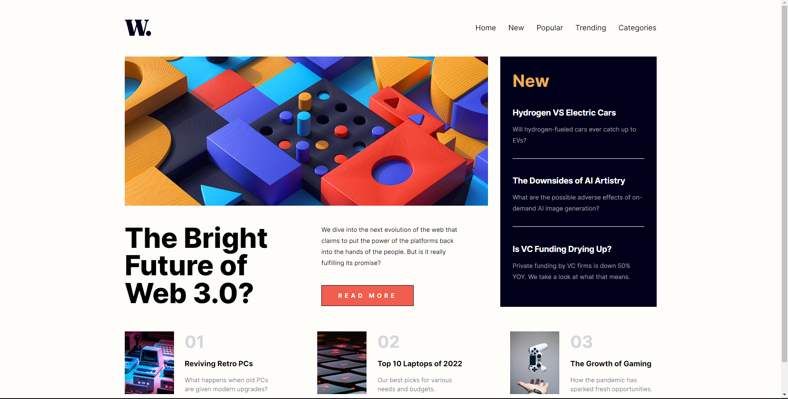
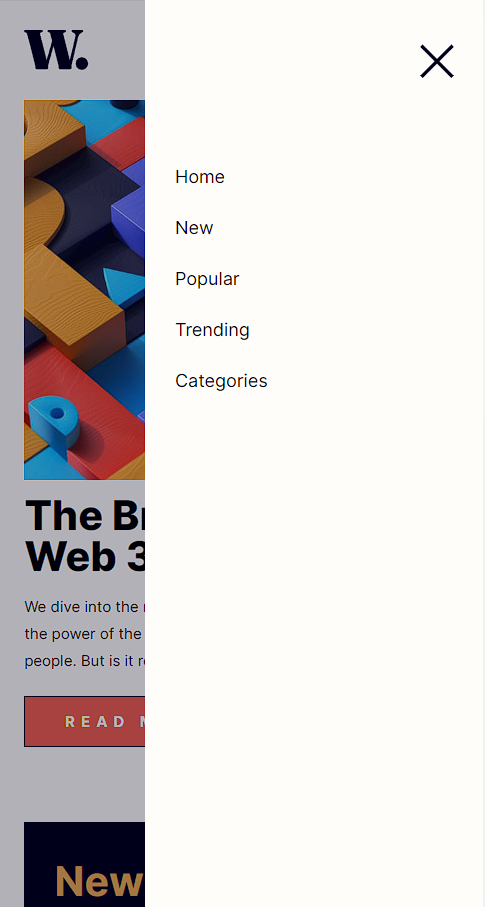

# Frontend Mentor - News homepage solution

This is a solution to the [News homepage challenge on Frontend Mentor](https://www.frontendmentor.io/challenges/news-homepage-H6SWTa1MFl). Frontend Mentor challenges help you improve your coding skills by building realistic projects. 

## Table of contents

- [Overview](#overview)
  - [The challenge](#the-challenge)
  - [Screenshot](#screenshot)
  - [Links](#links)
- [My process](#my-process)
  - [Built with](#built-with)
  - [What I learned](#what-i-learned)
  - [Continued development](#continued-development)
  - [Useful resources](#useful-resources)
- [Author](#author)
- [Acknowledgments](#acknowledgments)

## Overview

### The challenge

Users should be able to:

- View the optimal layout for the interface depending on their device's screen size
- See hover and focus states for all interactive elements on the page

### Screenshot


 

### Links

- Live Site URL: [https://tjrelly.github.io/news-homepage/](https://tjrelly.github.io/news-homepage/)

## My process

### Built with

- Semantic HTML5 markup
- CSS custom properties
- Flexbox
- CSS Grid
- Mobile-first workflow

### What I learned

To see how you can add code snippets, see below:

```css
.show-menu .nav {
    background: hsla(240, 100%, 5%, 0.3);
    display: flex;
    flex-direction: column;
    justify-content: flex-start;
    align-items: flex-end;
    width: 100%;
    height: 100%;
    position: absolute;
    top: 0;
    right: 0;
}
```
```js
const menuBtn = Array.from(document.querySelectorAll(".menu-btn"));
const header = document.querySelector("header");
const nav = document.querySelector(".nav ul")

for (btn in menuBtn) {
  menuBtn[btn].onclick = toggleMenu;
}

function toggleMenu() {
    header.classList.toggle("show-menu");
    nav.classList.toggle("active")
  }
```

### Continued development

## Author

- Website - [Terrell Jackson](https://terrelljackson.vercel.app/)
- Frontend Mentor - [@TJRelly](https://www.frontendmentor.io/profile/TJRelly)
- Twitter - [@TJR_Tech](https://www.twitter.com/TJR_Tech)
