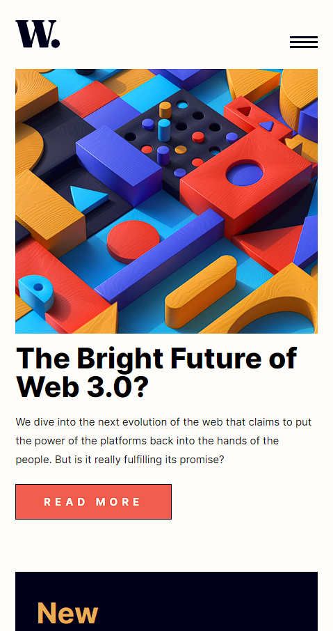

# Frontend Mentor - News homepage solution

This is a solution to the [News homepage challenge on Frontend Mentor](https://www.frontendmentor.io/challenges/news-homepage-H6SWTa1MFl). Frontend Mentor challenges help you improve your coding skills by building realistic projects. 

## Table of contents

- [Overview](#overview)
  - [The challenge](#the-challenge)
  - [Screenshot](#screenshot)
  - [Links](#links)
- [My process](#my-process)
  - [Built with](#built-with)
  - [What I learned](#what-i-learned)
  - [Continued development](#continued-development)
  - [Useful resources](#useful-resources)
- [Author](#author)
- [Acknowledgments](#acknowledgments)

**Note: Delete this note and update the table of contents based on what sections you keep.**

## Overview

### The challenge

Users should be able to:

- View the optimal layout for the interface depending on their device's screen size
- See hover and focus states for all interactive elements on the page

### Screenshot


 

### Links

- Live Site URL: [Add live site URL here](https://tjrelly.github.io/news-homepage/)

## My process

### Built with

- Semantic HTML5 markup
- CSS custom properties
- Flexbox
- CSS Grid
- Mobile-first workflow
- [React](https://reactjs.org/) - JS library
- [Next.js](https://nextjs.org/) - React framework
- [Styled Components](https://styled-components.com/) - For styles

### What I learned

To see how you can add code snippets, see below:

```html
<h1>Some HTML code I'm proud of</h1>
```
```css
.show-menu .nav {
    background: hsla(240, 100%, 5%, 0.3);
    display: flex;
    flex-direction: column;
    justify-content: flex-start;
    align-items: flex-end;
    width: 100%;
    height: 100%;
    position: absolute;
    top: 0;
    right: 0;
}
```
```js
const menuBtn = Array.from(document.querySelectorAll(".menu-btn"));
const header = document.querySelector("header");
const nav = document.querySelector(".nav ul")

for (btn in menuBtn) {
  menuBtn[btn].onclick = toggleMenu;
}

function toggleMenu() {
    header.classList.toggle("show-menu");
    nav.classList.toggle("active")
  }
```

If you want more help with writing markdown, we'd recommend checking out [The Markdown Guide](https://www.markdownguide.org/) to learn more.

**Note: Delete this note and the content within this section and replace with your own learnings.**

### Continued development

Use this section to outline areas that you want to continue focusing on in future projects. These could be concepts you're still not completely comfortable with or techniques you found useful that you want to refine and perfect.

**Note: Delete this note and the content within this section and replace with your own plans for continued development.**

## Author

- Website - [Add your name here](https://www.your-site.com)
- Frontend Mentor - [@yTJRelly](https://www.frontendmentor.io/profile/TJRelly)
- Twitter - [@TJR_Tech](https://www.twitter.com/TJR_Tech)
